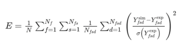
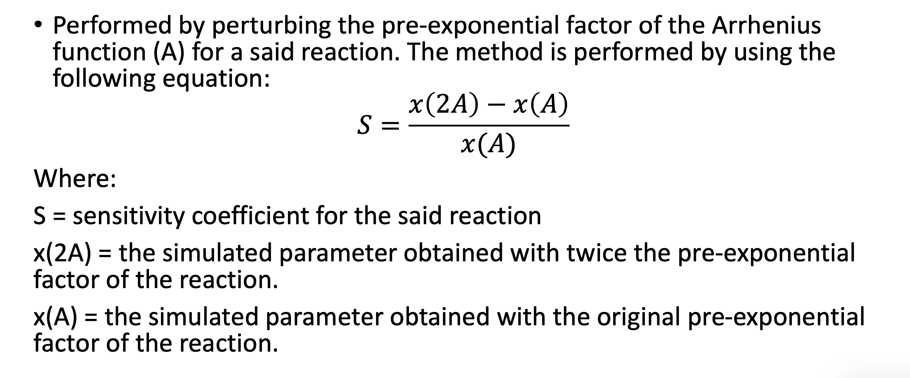
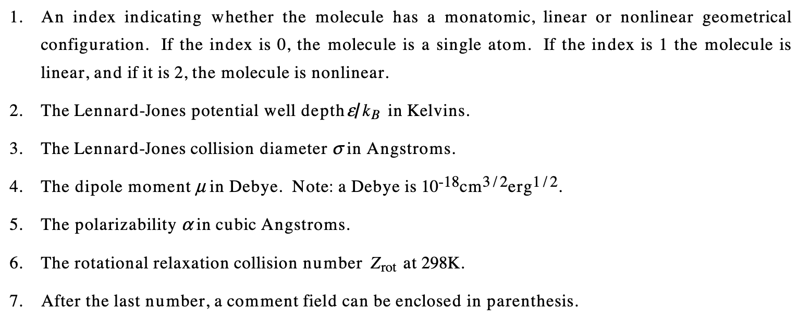
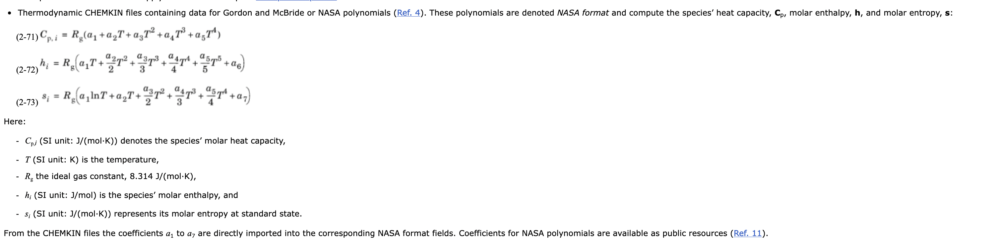

<h4>Lets assume that the following process needs to take place, initially:  </h4>
1. Experimental data is taken as an input, and the mechanism(s) are run for this data <br>
2. An error is calculated between the numerical and experimental data<br>
3. A ROP and sensitivity graphs are run to identify the key transport, thermo etc. constants<br>

<h4>In dynamic mechanism development, lets assume the following process takes place: </h4>
1. A few key reactions/factors are identified and perturbed dynamically within user specifications<br>
2. The numerical result is saved and a new error factor is calculated<br>
3. The factor values and score are saved and input into an optimisation algorithm<br>
4. The factors are perturbed again, and until optimised values are reached<br>
****

<h3> TO DO: </h3>

<br>[x] Clean and create a csv input file format for experimental input conditions and data
<br>[x] Run numerical results based on an input file and get output numerical files in csv format for the output directory
<br>[x] Plot experimental and numerical data on one graph
<br>[x] Calculate the error between numerical and experimental data
<br>[x] Undertake a ROP and sensitivity analysis for the main reactions and paste to file, given a specific input condition
<br>[ ] Switch to the solver adjoint method
<br>[ ] Undertake a thermo file sensitivity analysis
<br>[ ] Undertake  transport file sensitivity analysis
<br>[ ] Integrate the above with UFlame
<br>[ ] Allow dynamic opimisation of constants, given experimental boundaries of data for each constant
<br>[ ] Calculate a SUE sensitivity given, given experimental boundaries of data for each constant
<br>[ ] Release as a pip python package

****
<h3> ROP AND SENSITIVITY ANALYSIS </h3>
The rate of production can only be undertaken on various species, so the following rules are made for the run_rops_sens:  <br><br>
1. If the user specifies a species like 'NO', and its searchable in the mechanism, we run the sensitivity and rop analysis as usual on the species. The ROP can only include reactions in thhe mechanism, but sensitivity should be able to include thermo and transport files <br>
2. If the user species 'lbv', we can only run sensitivity analysis on that. This should only be an option available for freely_prop <br>

****

<h3> ERROR EQUATION: </h3>



<h3> SENSITIVITY ANALYSIS </h3>
Sensitivity analysis is undertaken using the brute force method, where variables are perturbed. 
The simulated parameter is either laminar burning velocity (velocity at inlet) or species at outlet. 




- For reactions, pre-exponential (A) factor is perturbed. 
- For transport properties the following list of variables are available: 



    The Lennard-Jones potential well depth (ε): This parameter represents the strength of intermolecular interactions. It often has some uncertainty due to variations in different potential energy models or fitting procedures.

    The Lennard-Jones collision diameter (σ): This parameter represents the size of molecules or atoms and can vary based on experimental measurements or estimation methods.

    The dipole moment (μ): This property measures the polarity of a molecule and can vary depending on the measurement technique or estimation method used. It is common for dipole moments to have uncertainties reported in the literature.

    The polarizability (α): This property describes how easily a molecule's electron cloud can be distorted by an external electric field. It can have variations based on the method used for calculation or experimental measurements.

    The rotational relaxation collision number (Zrot) at 298K: This parameter characterizes the rotational relaxation time of molecules in collisions. It can have uncertainties associated with experimental measurements or theoretical models used to calculate it.

- For the thermodynamic properties, these store the NASA polynomial coefficients for each temperature range.
- These polynomial coefficients are used to calculate the enthalpy, entropy and molar heat capacity.



****
<h3> HOW DO WE ACTUALLY PERTURB THE VALUES IN CODE VIA BRUTE FORCE? </h3>

The existing cantera set_multiplier function is as below. 
```
    def set_multiplier(self, double value, int i_reaction=-1):
        """
        Set the multiplier for for reaction ``i_reaction`` to ``value``.
        If ``i_reaction`` is not specified, then the multiplier for all reactions
        is set to ``value``. See `multiplier`.
        """
        if i_reaction == -1:
            for i_reaction in range(self.n_reactions):
                self.kinetics.setMultiplier(i_reaction, value)
        else:
            self._check_reaction_index(i_reaction)
            self.kinetics.setMultiplier(i_reaction, value)
```

****

<h3> EXAMPLES OF DATABASES </h3>
The main databases I have found are as follows: <br>
Py-RMG: <br>

https://rmg.mit.edu/database/transport/molecule/1%20C%20u0%20p0%20c0%20%7B2,T%7D%20%7B3,S%7D%0A2%20N%20u0%20p1%20c0%20%7B1,T%7D%0A3%20H%20u0%20p0%20c0%20%7B1,S%7D%0A
https://rmg.mit.edu/database/thermo/molecule/1%20C%20u0%20p0%20c0%20%7B2,T%7D%20%7B3,S%7D%0A2%20N%20u0%20p1%20c0%20%7B1,T%7D%0A3%20H%20u0%20p0%20c0%20%7B1,S%7D%0A

Respecth: <br>
https://respecth.elte.hu/find.php?id=159852&name=%20HCN
